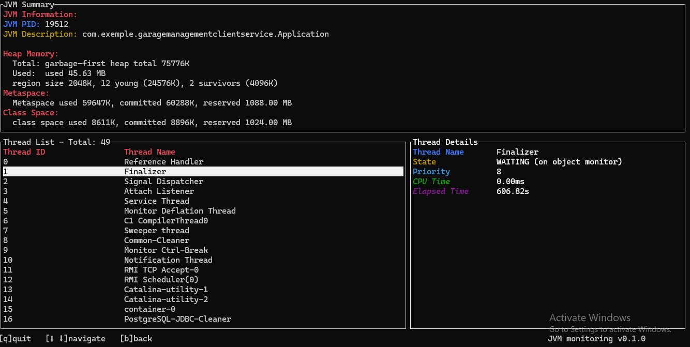

# JVM Monitoring Tool

This project is a terminal-based application developed in Rust using the TUI (Text-based User Interface) library. It provides a real-time monitoring solution for Java Virtual Machines (JVMs), focusing on essential metrics like heap memory, metaspace, and thread details.

## What is a JVM

JVM (Java Virtual Machine) is an abstract machine. It is a specification that provides runtime environment in which java bytecode can be executed.
JVM alongside with the bytecode are the components that makes Java platform independant.
## JVM components
The following are some useful sources to learn more about the JVM and its component.


- [5 JVM Components](https://medium.com/@kavindaperera25/5-main-components-of-jvm-a46e8c4d8d95)
- [JVM Architecture](https://www.javatpoint.com/jvm-java-virtual-machine)
- [JVM Memory model](https://www.digitalocean.com/community/tutorials/java-jvm-memory-model-memory-management-in-java)

## Features

1. **JVM List Navigation**:
   - View a list of running JVMs on your system.
   - Navigate through the JVM list using intuitive keyboard controls.

2. **Real-time JVM Metrics**:
   - Monitor heap memory usage, metaspace, and class space with real-time updates.
   - View memory metrics in a user-friendly format, including conversions to MB for better readability.

3. **Thread Monitoring**:
   - Access a detailed list of active threads for a selected JVM.
   - Inspect thread details such as state, priority, CPU time, and elapsed time.

4. **User-friendly Interface**:
   - A clean and interactive terminal interface built with the `tui` crate.
   - Organized display for JVMs, threads, and memory metrics for ease of navigation.

## Application overview
1. **Listing the JVMs**:
After running the application the teminal shows a list of all the JVMs that are running in the system, we can then choose which one we want to visualize.

The following figure shows an example of the list:


2. **JVM details overview**:
After choosing a JVM and clicking the **Enter** button, the following figure dispalys to show the details of the JVM.




3. **JVM Summary**
This part contains the details of the JVM


- The first part is the informations about the JVM, it contains the **PID** and the **Description**.

- The second part is the Heap Memory, the heap memory is used for dynamic memory allocation for Java objects and classes. It is divided into regions to optimize garbage collection.
   - ***Total Heap Size***: Represents the total allocated size for the heap
   - ***Used Heap Size***: Indicates the amount of memory currently utilized in the heap.

   - ***Region***: The heap memory is divided into several regions to allow the garbage collector to function optimally. Each region is identified by its size and role (e.g., young, survivor).

      - ***Region Size***: Specifies the size of each region within the heap.

      - ***Young Regions***: Represents the number and total size of young generation regions.

      - ***Survivor Regions***: Represents the number and total size of survivor regions.


- The Third part is the Metaspace, this part stores class metadata and is dynamically resized as needed.:
   - ***Used Metaspace Size***: Indicates the amount of memory currently used in the Metaspace.

   - ***Committed Metaspace Size***: Represents the amount of memory reserved for future operations in the Metaspace.

   - ***Reserved Metaspace Size***: Defines the total available memory for the Metaspace, including parts not yet committed.
- The last part is ClassSpace, this section deals with memory allocated for class definitions.

   - ***Used Class Space Size***: The amount of memory currently used for class definitions.

   - ***Committed Class Space Size***: The amount of memory committed for storing class definitions.

   - ***Reserved Class Space Size***: The total memory reserved for class definitions, including uncommitted portions.
   
4. **Thread List**:

This part shows the list of all the threads in the JVM, we can go up and down to choose on of the thread we want to show its details.

5. **Thread details**:

This section displays detailed information about a selected thread. Once a thread is selected from the list, its detailed information is shown. These details include:

   - ***Thread Name***:The name of the thread as identified in the JVM.

   - ***Thread State***: The current state of the thread (e.g., RUNNABLE, WAITING).

   - ***Priority***: The priority level assigned to the thread.

   - ***CPU Time***: The amount of CPU time utilized by the thread.

   - ***Elapsed Time***: The total time elapsed since the thread was created.

Now to test the application in your local machine you can follow the following steps:  
## Prerequisites

Ensure the following are installed on your system:

1. **Rust**:
   - Install Rust from the [official Rust website](https://www.rust-lang.org/tools/install).

2. **Java**:
   - Ensure Java is installed and added to your system's PATH.
   - The tool relies on the `jcmd` command-line utility, which is part of the Java Development Kit (JDK).

## Getting Started

### Clone the Repository

Clone the project repository to your local machine:

```bash
git clone https://github.com/HassanBouighamdane/JVM-Monitoring.git
cd JVM-Monitoring
```
## Build and Run
Build and run the application using the following commands:

  ```bash
  cargo build --release
  cargo run
  ```

## Locate the Executable
After a successful build, find the executable in the `target/release` directory within the project folder.

## Run the Executable
You can now run the executable from any location on your machine using the following command:

- On Unix-based systems:

  ```bash
  ./jvm_monitoring
  ```

- On Windows:

  ```bash
  .\jvm_monitoring.exe
  ```
